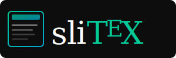

<p align="center">
  
</p>

<p align="center">
  <strong>LaTeX Beamer presentations in the browser — live, multi-window, with real-time sync.</strong>
</p>

<p align="center">
  <a href="https://github.com/omurilo/slitex/releases/latest"></a>
  <a href="go.mod"></a>
  <a href="LICENSE"></a>
</p>

---

**slitex** parses a `.tex` Beamer file and renders it as an interactive, browser-based presentation.  
No PDF generation. No LaTeX installation required. Just point it at your `.tex` file and go.

## Features

- **Zero-dependency runtime** — single Go binary, UI embedded inside
- **Live reload** — edits to the `.tex` file are reflected instantly in the browser
- **Multi-window sync** — Presenter, Projector, and Overview windows stay in sync via Server-Sent Events
- **Overlay/animation support** — `\only`, `\onslide`, `\visible`, `\uncover` and pause steps
- **Math rendering** — inline and display math via [KaTeX](https://katex.org)
- **BibTeX** — `\bibliography` / `\bibresource` + `\cite` support
- **12 built-in themes** — see [Themes](#themes)
- **Multiple views** — Landing, Presenter, Projector, Overview, Print

## Installation

### go install

If you have Go 1.23+ installed:

```sh
go install github.com/omurilo/slitex@latest
```

The binary will be placed in `$(go env GOPATH)/bin`.

### Pre-built binary

Download the latest release for your platform from the [Releases page](https://github.com/omurilo/slitex/releases/latest).

| Platform       | File                            |
|----------------|---------------------------------|
| Linux x86-64   | `slitex_linux_amd64`            |
| Linux ARM64    | `slitex_linux_arm64`            |
| macOS x86-64   | `slitex_darwin_amd64`           |
| macOS Apple Silicon | `slitex_darwin_arm64`      |
| Windows x86-64 | `slitex_windows_amd64.exe`      |
| Windows ARM64  | `slitex_windows_arm64.exe`      |

Make the binary executable and move it to your `$PATH`:

```sh
chmod +x slitex_linux_amd64
sudo mv slitex_linux_amd64 /usr/local/bin/slitex
```

### Build from source

Prerequisites: **Go 1.23+** and **Node.js 20+**

```sh
git clone https://github.com/omurilo/slitex.git
cd slitex

# 1. Build the React frontend (outputs to internal/ui/dist)
cd web && npm ci && npm run build && cd ..

# 2. Build the Go binary (embeds the UI)
go build -o slitex .
```

## Usage

```sh
slitex <command> [flags] <presentation.tex>
```

**Commands**
| Command | Description |
|---------|------------------------------------------|
| serve   | Serve the presentation with a dev server |
| build   | Build the presentation as static spa     |
| print   | Print the presentation as PDF            |

**Flags**

| Flag     | Default | Description              |
|----------|---------|--------------------------|
| `-port`  | `3000`  | HTTP port to listen on   |

**Examples**

```sh
# Start the dev server on the default port
slitex my_talk.tex

# Use a custom port
slitex -port 3000 my_talk.tex
```

The browser opens automatically at `http://localhost:3000`.

## Views

| View       | URL             | Description                                                    |
|------------|-----------------|----------------------------------------------------------------|
| Landing    | `/`             | Current slide + navigation controls + links to other views     |
| Projector  | `/projector`    | Full-screen slide, synced with all other windows               |
| Presenter  | `/presenter`    | Slide + next-slide preview + notes + elapsed timer             |
| Overview   | `/overview`     | Thumbnail grid of all slides                                   |
| Print      | `/print`        | All slides stacked for printing / PDF export                   |

## Themes

slitex ships with all classic Beamer themes:

| | | | |
|---|---|---|---|
| default | metropolis | madrid | warsaw |
| frankfurt | copenhagen | berlin | boadilla |
| cambridgeus | darmstadt | annarbor | berkeley |

Select a theme in your `.tex` preamble:

```latex
\usetheme{metropolis}
```

## LaTeX Support

slitex supports a subset of Beamer commands. Key supported features:

**Preamble**
- `\title`, `\subtitle`, `\author`, `\institute`, `\date`
- `\usetheme{<name>}`
- `\usepackage`

**Frames**
- `\begin{frame}[options]{title}{subtitle}` / `\end{frame}`
- `\frametitle`, `\framesubtitle`
- `\titlepage`, `\tableofcontents`
- Frame option: `plain`

**Content**
- `\begin{itemize}` / `\begin{enumerate}`
- `\begin{columns}` / `\begin{column}`
- `\begin{block}`, `\begin{alertblock}`, `\begin{exampleblock}`
- `\begin{verbatim}`, `\begin{lstlisting}`
- `\includegraphics`
- `\begin{tabular}`
- `\begin{quote}`
- `\vfill`, `\vspace`

**Inline**
- `\textbf`, `\textit`, `\texttt`
- `\alert`, `\color`, `\textcolor`
- `\href`, `\url`
- `$...$`, `\[...\]` (math via KaTeX)
- `\cite`, `\bibliography`, `\bibresource`

**Overlays**
- `\pause`
- `\only<n>`, `\onslide<n>`, `\visible<n>`, `\uncover<n>`
- Overlay spec `<n->`, `<n-m>`

## Development

```sh
# Terminal 1 — Go dev server (uses Vite proxy, no embed needed)
go run . serve -port 3000 path/to/talk.tex

# Terminal 2 — Vite dev server (hot module reload)
cd web && npm run dev
```

The Vite config proxies `/api` and `/themes` to `localhost:3000`, so both servers work together during development.

## Contributing

Issues and pull requests are welcome. Please open an issue first for larger changes.

## License

[MIT](LICENSE)
